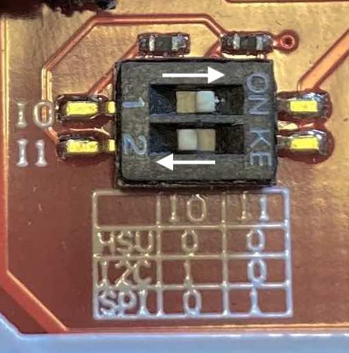
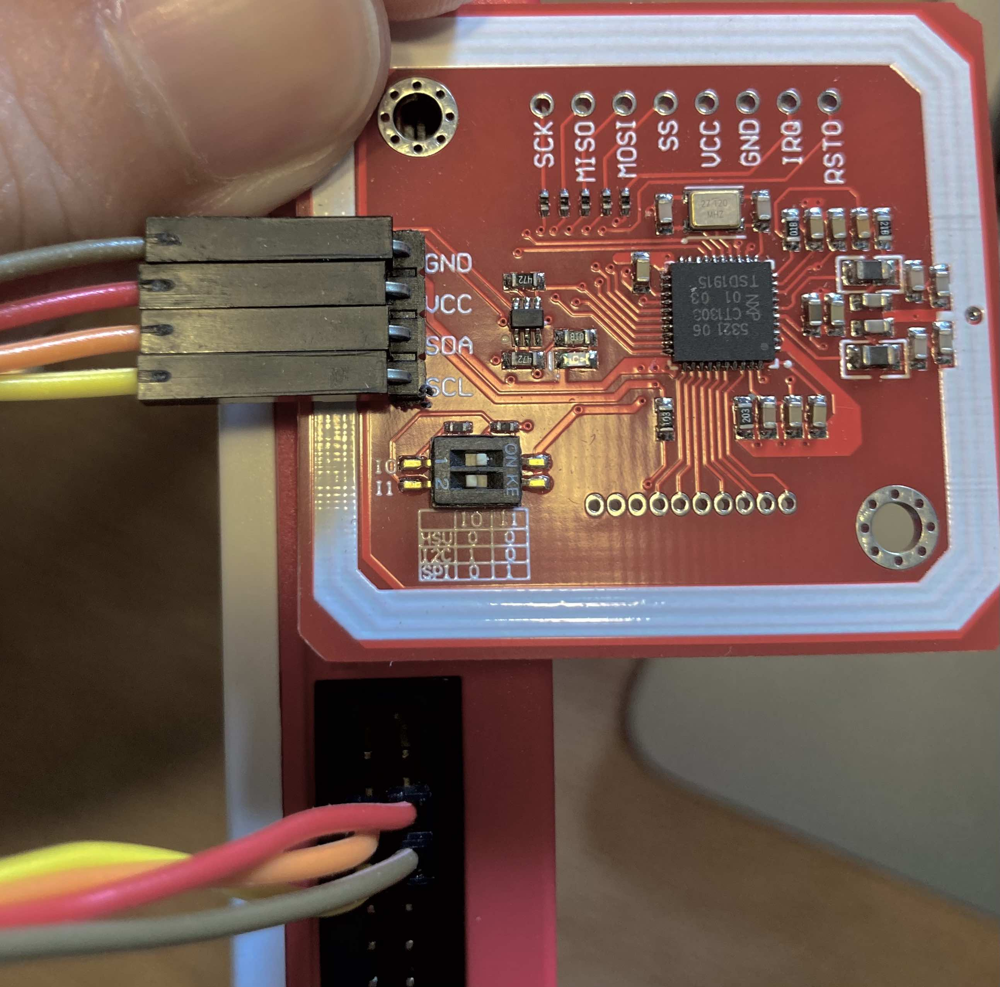

# NFC
1. 本活動基於 PN532 與raspberry pi 連結後在 [pn532lib](https://github.com/HubCityLabs/py532lib) 套件協助下完成
1. 讀取 NTag215 內部資料後，控制馬達

# 課程內容
1. 16位元
1. NTag215資料格式
1. 硬體接線
	* [I2C](https://pinout.xyz)
	>
	* 按鈕 I0 = 1 , I1 = 0
	>
	* GND , VCC , SDA , SCL = pin 6 , 4 , 3 , 5
	>
1. 讀取 ID
1. 寫入資料
